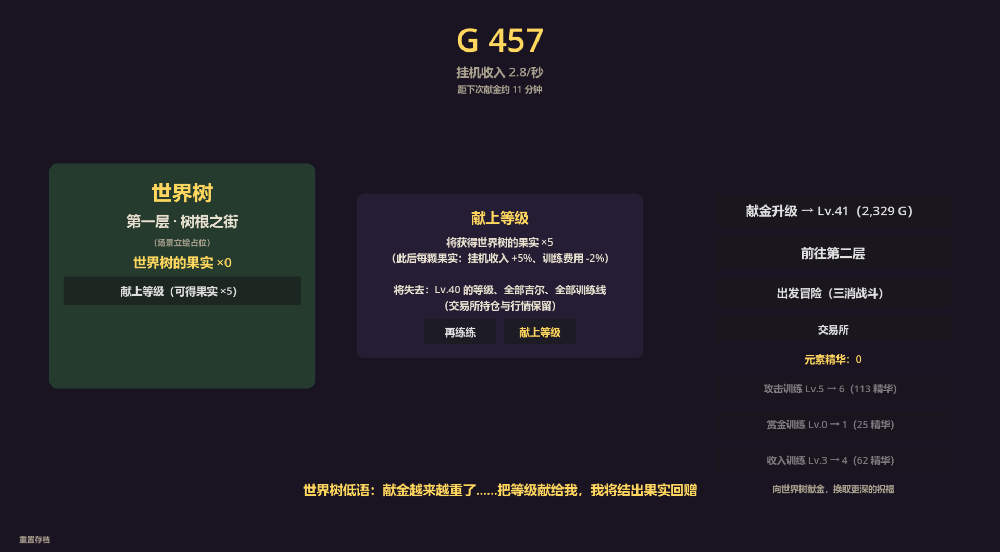
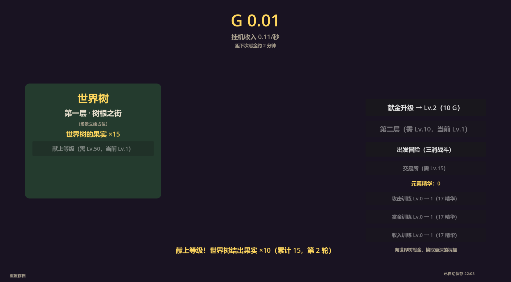

# 挂机放置增量 RPG · IdleTreeRPG

> 一款挂机放置 + 三消战斗 + 交易所的增量 RPG。向世界树献金升级、三消打怪赚钱、
> 炒元素行情、攒训练线——卡在墙头时，把等级献给世界树，换一颗永不失去的果实。



## 玩法速览

| 系统 | 一句话 |
| --- | --- |
| 🌳 挂机献金 | 等级即收入（0.06×1.10^级 G/秒），攒够吉尔向世界树献金升级 |
| 🗡️ 三消冒险 | 7×7 六元素棋盘，滑动交换=攻击；4 连出直线、L/T 出爆炸、5 连出魔力鸟 |
| 💪 训练线 | 元素精华三条线（攻击/赏金/收入各 +5%/级），消除越狠精华越多 |
| 🏛️ 交易所 | 火晶石/風羽绢/生命露三标的 K 线行情（Lv.15 解锁），1% 手续费低买高卖 |
| 🍎 **重生转生** | Lv.40 起可把等级献给世界树换「果实」：每颗永久 +5% 收入、-2% 训练费、+1% 攻击 |
| 🌲 层数 | 第一层·树根之街 → Lv.10 解锁第二层·翠枝回廊；精英守林古树是跨轮次的荣耀目标 |

## 运行（玩家）

1. 下载发布包，解压
2. 双击 `IdleTreeRPG.exe` 即玩（进度每 10 秒自动保存，关窗即存）
3. 存档在 `%APPDATA%\Godot\app_userdata\<工程名>\save.json`，换机可带走

## 从源码运行（开发者）

1. 安装 [Godot 4.7.2](https://godotengine.org/download)（标准版即可，本仓库用 steam 版开发）
2. 用 Godot 打开本目录（`project.godot`），F5 运行
3. 无头测试四套 + 重生 E2E 验收：

```powershell
$g = "C:\path\to\godot.exe"   # 你的 Godot 可执行文件
& $g --headless --path . --script res://tests/balance_test.gd   # 数值公式
& $g --headless --path . --script res://tests/match3_test.gd    # 三消逻辑
& $g --headless --path . --script res://tests/market_test.gd    # 交易所
& $g --headless --path . res://tests/rebirth_e2e.tscn           # 重生 E2E 验收
& $g --headless --path . --script res://tests/sim_test.gd       # 数值模拟试玩（较久）
```

4. 构建发布包（需先安装 4.7.2 导出模板）：

```powershell
& $g --headless --path . --export-release "Windows Desktop" build/IdleTreeRPG.exe
```

## 构建（P4 流程备忘）

- 导出预设：`export_presets.cfg`（Windows Desktop，pck 内嵌单文件 `build/IdleTreeRPG.exe`）
- 模板安装：把 `Godot_export_templates.tpz` 解压到
  `%APPDATA%\Godot\export_templates\4.7.2.stable.steam\`（目录名必须与编辑器版本串一致）
- 发布包就绪判据：`build/IdleTreeRPG.exe` 双击可玩、无控制台窗口、自动存档正常

## 文档导航

| 文档 | 内容 |
| --- | --- |
| [`docs/游戏设计文档.md`](docs/游戏设计文档.md) | 设计事实源：拍板决策 §6、数值 §7、模拟 §12、重生设计 §14 |
| [`docs/开发路线图.md`](docs/开发路线图.md) | 里程碑与下一步方向 |
| [`docs/开发纪事.md`](docs/开发纪事.md) | 开发脉络时间线 |
| [`docs/日报/`](docs/日报) | 每日日报（最新进展看最新一篇） |
| [`docs/开发环境.md`](docs/开发环境.md) | 环境备忘与协作约定 |


